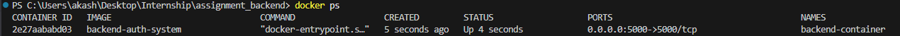

# Backend for Authentication System

This is the backend for an authentication system using Node.js, Express, MongoDB, and JWT for managing user signup and login functionalities.

## Features

- User Signup
  - Stores user details (username, email, password) in MongoDB.
  - Returns a JWT token on successful signup.
- User Login
  - Authenticates users with email and password.
  - Returns a JWT token on successful login.
- JWT-based Authentication
  - Protects routes by validating JWT tokens.

## Tech Stack

- **Node.js**: Backend runtime environment.
- **Express.js**: Web framework for Node.js.
- **MongoDB**: NoSQL database for user data storage.
- **Mongoose**: ODM library for MongoDB.
- **jsonwebtoken (JWT)**: For token-based authentication.
- **dotenv**: For environment variable management.

## Project Structure

```
backend/
├── models/
│   └── User.js        # User model definition
├── routes/
│   └── auth.js        # Authentication routes
├── app.js             # Entry point for the server
├── package.json       # Project metadata and dependencies
└── .env               # Environment variables (not included in the repo)

```

## Docker Installation
To run this backend inside a Docker container, follow these steps:

1. Build the docker container 
   ```
   docker build -t backend-auth-system .
   ```

2. Run the docker container 
   ```
   docker run -d -p 5000:5000 --name backend-container --env-file .env backend-auth-system
   ```

3. Verify the container is running
   ```
   docker ps
   ```
If the container is running successfully, you should see it in the list of active containers.

3. Stopping and removing docker container
   ```
   docker stop backend-container
   docker rm backend-container
   ```


## Installation
1. Clone the repository:
   ```bash
   git clone <repository-url>
   ```
2. Install dependencies:
   ```bash
   npm install
   ```
3. Set up environment variables:
    Create a .env file in the root directory and add the following
    ```bash
    MONGO_URI=mongodb+srv://<your-db-uri>
    JWT_SECRET=<your-jwt-secret>
   ```
4. Start the development server:
   ```bash
   node app.ts
   ```

## API Endpoints : 
- /signup : Method POST
- /login : Method POST

## Request and Response Examples

### Signup

#### Request:
- **Method**: `POST`
- **Endpoint**: `/signup`
- **Body**:
```json
{
  "username": "john_doe",
  "email": "john@example.com",
  "password": "123456"
}
```
- **Response**:
```json
{
  "token": "<jwt-token>",
  "username": "john_doe"
}
```

### Login

#### Request:
- **Method**: `POST`
- **Endpoint**: `/login`
- **Body**:
```json
{
  "email": "john@example.com",
  "password": "123456"
}
```
- **Response**:
```json
{
  "token": "<jwt-token>",
  "username": "john_doe",
  "message": "Login Successful"
}
```

## Screenshots

1. Set up docker container



## Future enhancements 
- Implement password hashing (e.g., using bcrypt).
- Add refresh tokens for improved security.
- Use middleware for route protection.